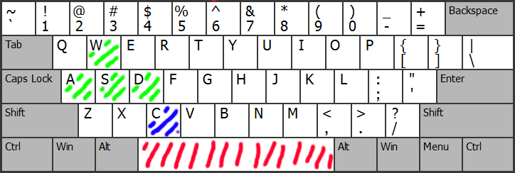

# Minecraft-Python-OpenGL
A little more complex Minecraft-like game made from scratch using Python and OpenGL.

Refactoring from [Simple Minecraft Python OpenGL](https://github.com/joaofavoretti/Simple-Minecraft-Python-OpenGL)

# How to run

The main file is `main.py`.

After downloading the requred packages, just type the following command in the terminal from the root directory of the project:

```
$ ./run
```

# Preview

<div align="center">
  
</div>

# User input

<div align="center">
  
</div>


- **WASD**: Move the camera in the same height

- **C**: Go down (Yeh, could not make neither Ctrl nor Shift work)

- **Space**: Go up